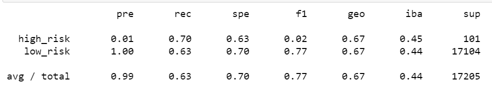
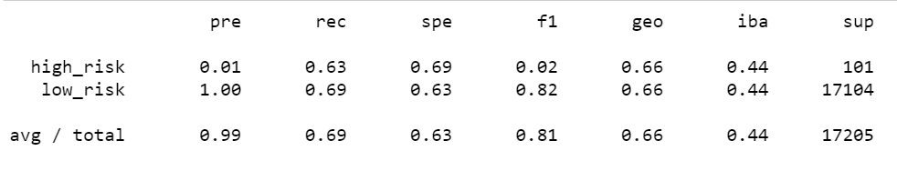
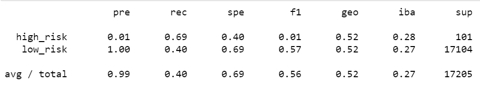
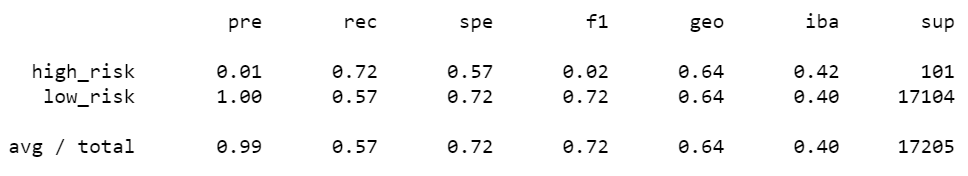
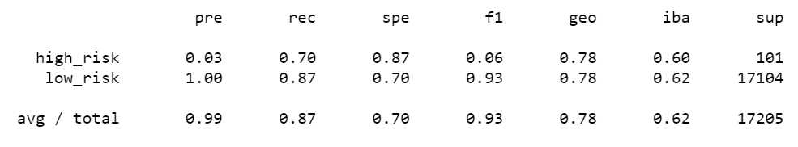
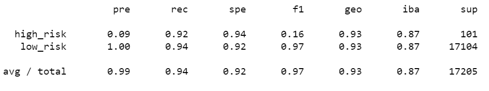

# Credit Risk Analysis

## Credit Risk Overview:
In this portion of the project, I'll use different techniques to train and evaluate models. Using the credit card credit dataset from LendingClub, I'll oversample the data using the RandomOverSampler and SMOTE algorithms and undersample the data using the ClusterCentroids algorithm. Then, I’ll combine over- and undersampling using the SMOTEENN algorithm. Next, I'll compare two new machine learning models that reduce bias, BalancedRandomForestClassifier and EasyEnsembleClassifier, in an attempt to predict credit risk. Once completed, I'll evaluate the performance of these models and make a written recommendation on whether they should be used to predict credit risk.

## Credit Risk Results:

### Oversampling
  -  RandomOverSampler - 
     
     
     -   Balanced Accuracy Score - 0.6663237827524566
     -   Precision - The low-risk seems very reliable, but high risk does not.
     -   Recall - There is a decent likelhood of correctness low-risk at .70 and high-risk at .63.
 
 -  SMOTE - 
     
      
     - Balanced Accuracy Score - 0.6623064259185507  
     - Precision - The low-risk seems very reliable, but high risk does not.
     - Recall - There is a decent likelhood of correctness with high-risk at .63 and low-risk at .69.

### Undersampling
 - ClusterCentroids - 
 
     
    - Balanced Accuracy Score - 0.6623064259185507  
    - Precision - Reliable positive classification for low-risk, but unrealiable at .01 for high-risk.
    - Recall- This is low, comparitively speaking, at .40 for low-risk (majority class) but decent for high-risk.

### Over- and Undersampling
  
  - SMOTEENN - 
  
    
    - Balanced Accuracy Score - 0.6447701423556762   
    - Precision - This model is very reliable for low-risk and low for low-risk.
    - Recall  - There are relatively high percentages for both with low-risk at .57 and high-risk at .72.

### Ensemble Classifiers
  
  - BalancedRandomForestClassifier - 
  
    
    - Balanced Accuracy Score  - 0.7885466545953005 
    - Precision - This model was reliable for low-risk and a bit higher on high-risk than others up to this point.
    - Recall - This model show to be catagorized correctly with low-risk at .87 and high-risk at .70.
  
  
  - EasyEnsembleClassifier - 
  
   
   - Balanced Accuracy Score  - 0.9322447299687874
   - Precision - Reliablilty is higher for high-risk than any other model at .09 and still reliable for the majority class (low-risk) at 1.
   - Recall - It seems that the sensitivity is very high for this with .92 high-risk (far higher than others) and .94 for low-risk.

## Credit Risk Summary: 
The results of many of the models were very similiar with slight differences in results.  I would recommend the EasyEnsembleClassifier because of the higher balanced accuracy score, higher precision score for the minority class, and higher sensitivity for both high and low risk.  This model learns from the errors of the previous model.  After evaluating the errors of the first model, another model is trained by weighting errors in subsequent models. This process is repeated until the error rate is minimized, and it also runs efficiently on large datasets.
